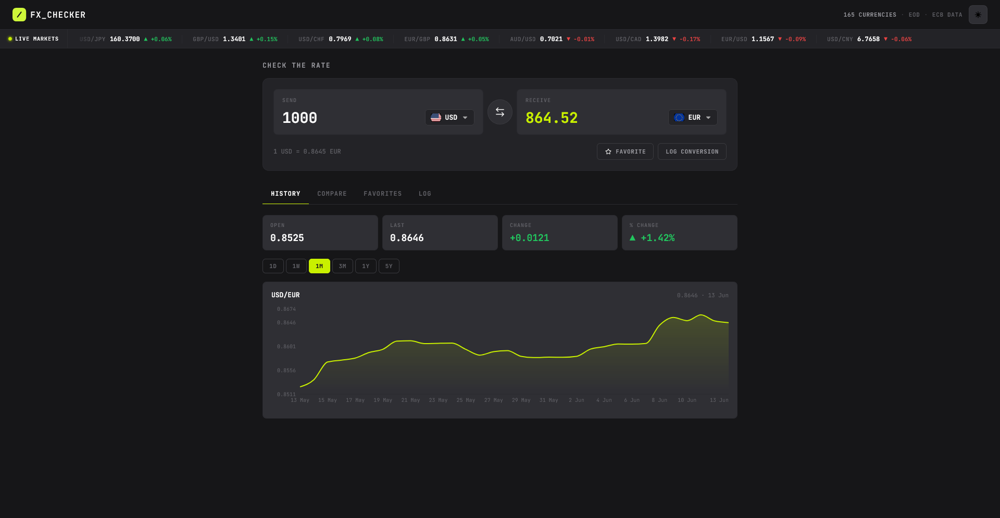

# Frontend Mentor - Foreign Exchange Currency Converter

This is a solution to the [Foreign Exchange Currency Converter challenge on Frontend Mentor](https://www.frontendmentor.io/challenges/foreign-exchange-currency-converter). Frontend Mentor challenges help you improve your coding skills by building realistic projects.

## Table of contents

- [Overview](#overview)
  - [The challenge](#the-challenge)
  - [Screenshot](#screenshot)
  - [Links](#links)
- [My process](#my-process)
  - [Built with](#built-with)
  - [What I learned](#what-i-learned)
  - [Continued development](#continued-development)
  - [AI Collaboration](#ai-collaboration)
- [Author](#author)

## Overview

### The challenge

Users should be able to:

#### Converter

- Enter an amount to send and see it convert in real time as they type
- Pick the "send" and "receive" currencies from a searchable currency picker
- See the live exchange rate for the active pair (e.g. `1 USD = 0.8530 EUR`)
- Swap the send and receive currencies with the swap button
- Favorite the active pair and log a conversion to their history

#### Currency picker

- Search the full list of available currencies by code or name
- See currencies grouped into "Popular" and "Other currencies", each row showing the flag, code, and name
- See a check against the currently selected currency
- Navigate the list with arrow keys and select with Enter

#### Live markets ticker

- See a scrolling ticker of currency pairs with their current rate and direction indicator
- Pause the ticker on hover

#### Rate history

- View an area chart of the active pair's rate over time
- Switch the chart range between 1D, 1W, 1M, 3M, 1Y, and 5Y
- See open, last, absolute change, and percentage change for the selected range

#### Compare

- See their send amount converted into multiple currencies at once, each with its reference rate
- Pin or unpin any comparison row to favorites directly from this tab

#### Favorites

- See all pinned pairs with their live rates
- Load a pinned pair back into the converter by clicking its row
- Unpin a pair they no longer want to track

#### Conversion log

- See a log of all logged conversions with relative timestamps, pair, and amounts
- Clear the entire log or delete individual entries

#### UI & accessibility

- Responsive layout across all screen sizes
- Visible focus styles on every interactive element
- Full keyboard navigation throughout the app
- ARIA roles and live regions for screen readers
- Favorites, log, active tab, and theme preference persisted in localStorage across sessions
- Light/dark theme toggle in the header, defaulting to dark

### Screenshot



### Links

- Solution URL: [Add solution URL here](https://your-solution-url.com)
- Live Site URL: [Add live site URL here](https://your-live-site-url.com)

## My process

### Built with

- **Next.js 16** (App Router, Turbopack)
- **React 19** with TypeScript strict mode
- **styled-components v6** — sole styling method, SSR-compatible via custom registry
- **SWR** — data fetching with 60s polling for live rates
- **Recharts** — `AreaChart` with a lime gradient fill for the rate history chart
- **date-fns** — relative timestamps in the conversion log
- **Frankfurter v2 API** — free, no-key, ECB-backed exchange rate data
- **localStorage** — persistence for favorites, log, active tab, and theme preference with hydration-safe hook
- **Biome 2.4.10** — linting and formatting (tabs, width 4)

### What I learned

#### Frankfurter v2 is a breaking change from v1

The v2 API completely renamed its endpoints and response shapes. `/latest` became `/rates`, the `symbols` query param became `quotes`, and history moved from a path-based range to `?from=&to=` query params. Most importantly, `/v2/rates` returns a **raw JSON array** of `{date, base, quote, rate}` objects — not the `{amount, base, date, rates: {}}` map that v1 returned. Figuring this out from the OpenAPI spec at `/v2/openapi.json` was the biggest unblocking move of the project.

```ts
// /v2/rates returns a flat array — parse it directly
const pairs: IRawRate[] = await res.json();
const rates: Record<string, number> = {};
for (const p of pairs) rates[p.quote] = p.rate;
```

#### styled-components SSR with Next.js App Router

Next.js App Router doesn't support the old `_document.tsx` injection pattern. The fix is a `ServerStyleSheet` registry using `useServerInsertedHTML` from `next/navigation`, which collects styles during the server render and flushes them into `<head>` before hydration — preventing the flash of unstyled content.

#### Hydration-safe localStorage hook

Reading localStorage on the server causes a mismatch because `window` doesn't exist. The solution is to default to the fallback value on first render and read from localStorage only inside a `useEffect`, returning a `hydrated` boolean so consumers can defer rendering until the value is confirmed.

```ts
const [value, setValue] = useState<T>(fallback);
const [hydrated, setHydrated] = useState(false);

useEffect(() => {
	const stored = localStorage.getItem(key);
	if (stored) setValue(JSON.parse(stored));
	setHydrated(true);
}, [key]);
```

#### SWR for polled live rates

SWR's `refreshInterval` option handles the 60-second polling loop for live rates with zero boilerplate — it also deduplicates requests when multiple components subscribe to the same key, which matters for the ticker (8 pairs from one `/rates` call) and favorites (each row calls `/rate/{base}/{quote}` independently).

### Continued development

- **URL-persisted pair** — storing the active base/target in the URL query string would make conversions bookmarkable and shareable
- **Chart crosshair** — a custom Recharts `Tooltip` that tracks the cursor and shows the exact date and rate on hover
- **API fallback** — caching the last successful rates in localStorage and showing an out-of-date banner when the API is unreachable

### AI Collaboration

I used **Claude** (via Claude Code) as a debugging aid on a couple of tricky issues:

- **Frankfurter v2 response shape** — used it to cross-reference the OpenAPI spec at `/v2/openapi.json` when the endpoints weren't behaving as expected, which helped confirm that `/v2/rates` returns a raw array rather than the keyed object the v1 docs described
- **PowerShell output artifact** — flagged that `Invoke-RestMethod | ConvertTo-Json` wraps raw JSON arrays in a `{ value: [...] }` envelope, which was masking the real API response during local testing

The bulk of the work — architecture decisions, component design, styling, data flow, and accessibility — was done independently.

## Author

- Frontend Mentor - [@Ayokanmi-Adejola](https://www.frontendmentor.io/profile/Ayokanmi-Adejola)
- Twitter / X - [@yourusername](https://x.com/yourusername)
